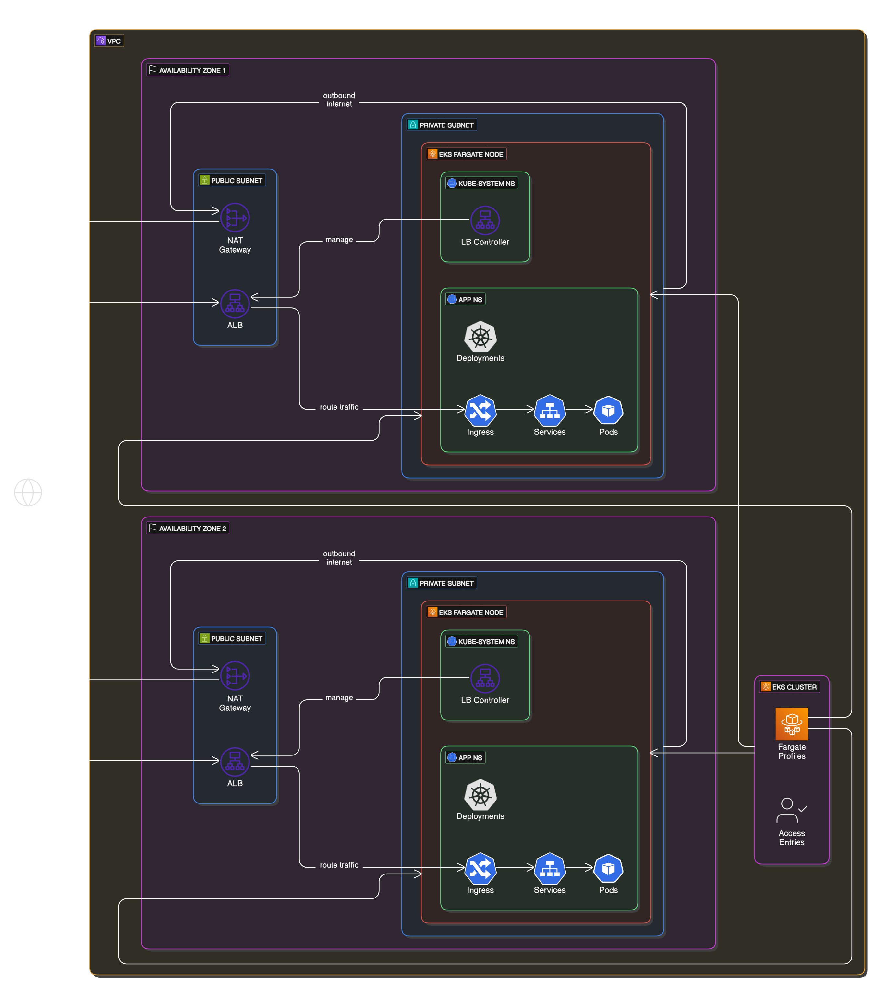

# Particle41 DevOps Team Challenge

## Task 1 - Minimalist Application Development / Docker / Kubernetes

### Tiny App Development: 'SimpleTimeService'

* SimpleTimeService is a web server based on Go, that returns a pure JSON response with the following structure, when its `/` URL path is accessed.

  ```
  {
    "timestamp": "<current date and time>",
    "ip": "<the IP address of the visitor>"
  }
  ```
---
### 📋 Prerequisites

  - Clone this repo.
  - Install [Docker Desktop](https://www.docker.com/products/docker-desktop/).

---

### 📦 Running the container
* Dockerfile of SimpleTimeService could be found [here](./app/Dockerfile).

    * To create the Docker image from Dockerfile:
      ```
      docker build -t sheikhabubaker19/simple-time-service .
      ```

    * Start the container:
      ```
      docker run -d -p 8080:8080 sheikhabubaker19/simple-time-service
      ```
    * Visit [localhost:8080](http://localhost:8080/) in your browser to access the web server.

* Checkout my [Docker hub](https://hub.docker.com/r/sheikhabubaker19/simple-time-service) for the official Docker Image of SimpleTimeService.

---
### 🔴  IMPORTANT NOTE

* SimpleTimeService is set to UTC timezone by default, however it is possible to change timezone by setting appropriate environment variables:
   ```
   docker run -p 8080:8080 -e TZ=SOME_VALID_TIMEZONE sheikhabubaker19/simple-time-service
   ```

* When SimpleTimeService is running locally and accessed on [localhost:8080](http://localhost:8080/) in the browser, the returned JSON response's `ip` value would be `172.17.0.1` which is the default Docker bridge network gateway IP address.
  ```
  {
    "timestamp": "<current date and time>",
    "ip": "172.17.0.1"
  }
  ```
* This ip is different from that of localhost is due to when the request is carried from the client to SimpleTimeService container, it is passed through Docker bridge network eventually making it the last hop, however this is not the case when the SimpleTimeService application is deployed to cloud infrastructure and true client ip could be seen.
---


## Task 2 - Terraform and Cloud: the infrastructure to host SimpleTimeService application

### 🛠️ Infrastructure Overview

This project sets up a **server-based AWS** infrastructure using **Terraform** to host the **SimpleTimeService** application. Below is a high-level view of the components involved:

- ✅ A **VPC** with:
  - 2 public subnets
  - 2 private subnets

- ✅ An **EKS (Elastic Kubernetes Service) cluster** deployed within the VPC.

- ✅ **AWS Fargate** to manage and provision the compute resources (nodes) for the EKS cluster.

- ✅ **Fargate profiles** are configured to ensure **Kubernetes** pods are scheduled **only on private subnets**.

- ✅ **AWS Application Load Balancer (ALB)** deployed to public subnets using:
  - **AWS Load Balancer Controller**
  - **Kubernetes Ingress** resource  
  This allows public internet traffic to be routed via the ALB to the application running inside private subnets.
---




---
### 📋 Prerequisites

  - Clone this repo.
  - Install [Terraform](https://developer.hashicorp.com/terraform/install)
  - Install [AWS CLI version 2](https://docs.aws.amazon.com/cli/latest/userguide/getting-started-install.html)
  - Setup [AWS CLI](https://docs.aws.amazon.com/eks/latest/userguide/install-awscli.html#configure-cli) (Create an access key and configure AWS CLI)
  - Install [kubectl](https://docs.aws.amazon.com/eks/latest/userguide/install-kubectl.html#kubectl-install-update)
  - Grant EKS Cluster Access to Your IAM User
    1. Find your IAM user ARN by running the following command in your terminal:

        ```
        aws sts get-caller-identity
        ```

    2. Copy the value of the "Arn" field. It will look like:

        ```
        "arn:aws:iam::<your-account-id>:user/<your-username>"
        ```

    3. Set your ARN as the principal_arn [here](terraform/terraform.tfvars)

        ```
        principal_arn = "arn:aws:iam::<your-account-id>:user/<your-username>"
        ```

        This will create an [EKS access entry](https://docs.aws.amazon.com/eks/latest/userguide/access-entries.html) and associate the [AmazonEKSClusterAdminPolicy](https://docs.aws.amazon.com/eks/latest/userguide/access-policy-permissions.html#access-policy-permissions-amazoneksclusteradminpolicy) to give your IAM user admin access to the EKS cluster
  - Setting **Timezone** (Optional)

     SimpleTimeService accepts a TZ environment variable to control the timezone of the displayed time. By default, it's set to UTC in the Terraform deployment:

      ```
      env {
        name = "TZ"
        value = "UTC"
      }
      ```

      You can customize this value by editing the kubernetes_deployment [resource](terraform/modules/kubernetes/main.tf), e.g., set it to Asia/Kolkata, America/New_York, etc.

---
### 📦 Deploying the Infrastructure

The deployment process is intentionally split into **2 phases** due to critical dependencies which arise after the EKS cluster is created:

1. **Kubeconfig Must Be Set for Terraform to Continue:**

   After the EKS cluster is created in Phase 1, a **kubeconfig** file must be created or updated to point to the new cluster.  
   Without this step, **Terraform** cannot connect to the **EKS cluster** to create **Kubernetes** resources like **deployments**, **services**, **ingress**, etc.

2. **CoreDNS Needs to Be Restarted for Fargate Scheduling:**

   AWS Fargate is used to schedule Kubernetes pods onto **nodes** in **private subnets**.  
   However, **Fargate profiles take a moment to come up** after the cluster is created. During this time, Kubernetes **CoreDNS** pods may remain in a `Pending` state.  
   Restarting the CoreDNS deployment ensures that the pods are scheduled onto the newly available Fargate nodes.  
   Without **CoreDNS**, **Kubernetes DNS** will not function, and the **Load Balancer** will fail to come up properly.

---

-  #### 🚀 Phase 1: Create Infrastructure Partially

    In the first phase, we’ll deploy the following modules only:

      - vpc
      - subnet
      - eks
      - eks-access-entry

      These are necessary to establish networking, EKS cluster and EKS access entries.

      ✅ Run the following commands [here](./terraform) 
      ```
      terraform init
      terraform plan
      terraform apply \
        -target=module.vpc \
        -target=module.subnet \
        -target=module.eks \
        -target=module.eks-access-entry
      ```

      ⚠️ Note: You will see a warning like the one below — this is expected when using -target:

      ```
      Warning: Resource targeting is in effect

      You are creating a plan with the -target option, which means that the result of this plan may not represent all of the changes requested by the current configuration.

      The -target option is not for routine use, and is provided only for exceptional situations such as recovering from errors or mistakes, or when Terraform specifically suggests to use it as part of an error
      message.

      ```

      This is normal since we are intentionally applying only part of the configuration in this phase.

      #### 🔧 Update Kubeconfig
      
      Once the EKS cluster is created, create/update your kubeconfig to connect to the cluster:

      ```
      aws eks update-kubeconfig --region us-east-1 --name Simple-Time-Service-EKS-Cluster
      ```

      #### ⚙️ Check and Restart CoreDNS Pods (if needed)
      
      After the EKS cluster is ready, CoreDNS pods may be stuck in Pending state because Fargate profiles takes a moment to be created. You need to manually restart the CoreDNS deployment to schedule CoreDNS pods:
      1. Check current CoreDNS pod status:
            ```
            kubectl get pods -n kube-system
            ```
          Example output:
          ```
          NAME                       READY   STATUS    RESTARTS   AGE
          coredns-6b9575c64c-lcmtn   0/1     Pending   0          10m
          coredns-6b9575c64c-x9gqm   0/1     Pending   0          10m
          ```
      2. Restart the CoreDNS deployment:

          ```
          kubectl rollout restart deployment coredns -n kube-system
          ```
      3. Ensure pods are in Running state:

          ```
          kubectl get pods -n kube-system
          ```

          Example output:

            ```
            NAME                      READY   STATUS    RESTARTS   AGE
            coredns-5d78c56f6-8ztqw   1/1     Running   0          56s
            coredns-5d78c56f6-fgftn   1/1     Running   0          56s
            ```

---
- #### ✅ Phase 2: Apply Remaining Modules
    With the updated kubeconfig pointing to the newly created EKS cluster and CoreDNS pods up and running, you can now apply the remaining infrastructure:

    ```
    terraform plan
    terraform apply
    ```

    This will deploy:

    - **AWS Load Balancer Controller**.

    - **Kubernetes** objects (services, deployment, ingress, etc.).
---    
    

## 🌐 Accessing the Application

After successfully applying all the Terraform configurations, you can retrieve the **Ingress address** to access the deployed `SimpleTimeService` application.


### 🔍 **Option 1: Using `kubectl` CLI**

Run the following command:

```bash
kubectl get ingress -n app
```

Example output:

```
NAME                CLASS   HOSTS   ADDRESS                                                              PORTS   AGE
simple-ts-ingress   alb     *       k8s-app-simplets-0ee6353f76-1714081194.us-east-1.elb.amazonaws.com   80      40m
```

> 📌 **Note:** The `ADDRESS` field is the DNS name of the AWS ALB (Application Load Balancer) created for the Ingress resource.

Copy the DNS name and open it in your browser:

```
http://k8s-app-simplets-0ee6353f76-1311081194.us-east-1.elb.amazonaws.com
```

> 📌 **Note:** Provisioning of Load Balancers is not instant, it takes a moment to come up and work as expected, if initially errors like `This site can’t be reached` occurs, try **reloading** or if it's been some decent time e.g 5 mins or above and the Load Balancer DNS name still shows the same error consider clearing **cache** from your browser and visit the DNS name again.

---

### 🖥️ **Option 2: Using the AWS Console**

1. Open the **AWS EC2 Load Balancer** [Dashboard](https://us-east-1.console.aws.amazon.com/ec2/home?region=us-east-1#LoadBalancers:).

2. Locate the **Load Balancer** with a name starting with `k8s-app-simplets`.

3. Copy the **DNS name** of the load balancer.

4. Paste it into your browser to access the application.

--- 


## Deleting the Infrastructure

To delete all the infrastructure created by Terraform, run the following command from the [here](./terraform/):

```
terraform destroy
```

---
